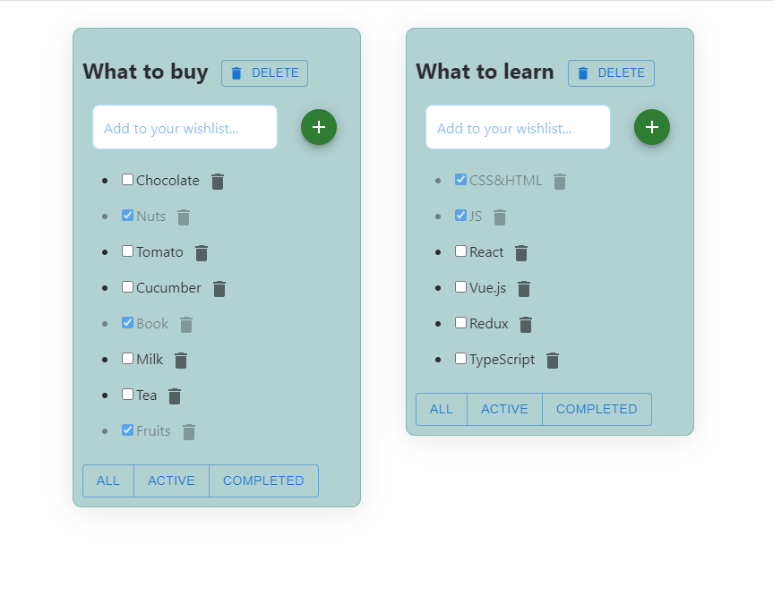

<h2>Todo List Web Application</h2>

This is a simple web application for managing your daily tasks and to-do lists. It allows users to create, update, and delete tasks, as well as mark them as completed. The application provides an intuitive user interface and offers essential features for effective task management.

<h2>Live Demo</h2>
A live demo of the web application can be accessed  <a href="https://volodymyrkolisnichenko.github.io/todo-list-2/" target="_blank"> here. 

<h2>Features</h2>
Create new tasks with a title and optional description.
Mark tasks as completed to keep track of progress.
Update existing tasks to modify their details.
Delete tasks that are no longer needed.
Responsive design for seamless usage across devices.
Technologies Used
HTML: Markup language for creating the structure and content of the web application.
CSS: Stylesheets for defining the visual appearance and layout of the application.
JavaScript: Programming language used for adding interactivity and functionality.
Bootstrap: CSS library.
Other libraries or frameworks: The project may utilize additional libraries or frameworks to enhance the user experience and improve development efficiency. Refer to the project's source code for more details.
<h2>Usage</h2>
To use the web application locally, follow these steps:

<h3>Clone the repository:</h3>
git clone https://github.com/volodymyrkolisnichenko/todo-list-2.git

<h3>Navigate to the project directory:</h3>
cd todo-list-2

Open index.html in your web browser to launch the application.

<h2>Contributing</h2>
Contributions are welcome! If you would like to contribute to the project, please follow these steps:

<h3>Fork the repository.</h3>
<h3>Create a new branch for your feature or bug fix.</h3>
<h3>Make your modifications.</h3>
<h3>Commit and push your changes.</h3>
<h3>Submit a pull request explaining the changes you made.</h3>

<h2>License</h2>
This project is licensed under the MIT License.

<h2>Acknowledgments</h2>
This project was developed to simplify task management and increase productivity. Thank you to all the open-source contributors whose libraries and tools were used in this project.

<h2>Contact</h2>
For any questions, feedback, or inquiries, please contact  <a href="https://github.com/VolodymyrKolisnichenko" target="_blank"> Volodymyr Kolisnichenko. 
